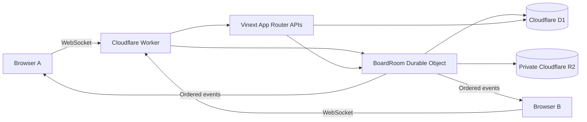

# CollabEdge

[繁體中文](README.md) · **English**

[](https://github.com/happyloa/collab-edge/actions/workflows/ci.yml)

A shared project workspace that makes realtime collaboration explicit: ordered changes, recoverable conflicts, and a clear source of truth.

[Source](https://github.com/happyloa/collab-edge) · [Architecture](docs/architecture.en.md) · [Protocol](docs/realtime-protocol.md) · [Security and quotas](docs/security.md)

**Deployment:** [CollabEdge on Workers](https://collab-edge.piafyoyo06.workers.dev), protected by owner-only Cloudflare Access email verification. GitHub About contains the same URL. The Worker is connected to this repository through native Workers Builds for `main`; GitHub Actions runs CI and publishes the separate static demo. Production attachments and preview URLs are disabled. See the [portfolio handoff](docs/portfolio-handoff.md) and [delivery status](docs/delivery-status.md) for completed work, release evidence and remaining acceptance checks.

**Public interactive demo:** [Try it without signing in](https://happyloa.github.io/collab-edge/). This separate GitHub Pages site runs entirely in your browser: edit, assign, filter, move, archive and restore sample cards, or simulate a conflicting edit. Reload or reset to discard changes. It does not call the production API or demonstrate live multi-user synchronization. [Watch the recorded local two-browser test](https://happyloa.github.io/collab-edge/#recorded-collaboration) below the playground. [Demo setup and boundaries](docs/public-demo.md).

**Live collaboration evidence:** [Follow the two-browser test walkthrough](docs/realtime-walkthrough.md) to reproduce Alice and Bob using the real local Worker, WebSocket and database, including conflict recovery and reconnect. Authenticated production collaboration still needs an owner Access smoke test.


## What to look at

Start with the illustrated scenarios in the public demo, then follow the [architecture guide](docs/architecture.en.md) into the implementation and tests.

| Collaboration problem                         | Implemented behavior                                                                                                       |
| --------------------------------------------- | -------------------------------------------------------------------------------------------------------------------------- |
| Who orders concurrent changes?                | One Durable Object coordinates each board; D1 holds canonical data and revisions.                                          |
| What if a notification is lost after a write? | Entity, revision and event commit atomically before broadcast. Reconnection can replay events.                             |
| Does retrying create duplicate data?          | The original mutation UUID is retained and protected by a unique database constraint.                                      |
| What happens to a conflicting edit?           | Per-field revisions detect conflicts while preserving the attempted draft for explicit retry.                              |
| How is demonstration usage bounded?           | Server limits, atomic quotas and release gates protect the private app; the public playground runs locally in the browser. |

The guide covers state ownership, mutation flow, safety boundaries, code pointers and remaining work. The two-person illustration is an explanatory model; [local two-browser evidence](docs/realtime-walkthrough.md) exercises the real Worker and WebSocket implementation.

## Why this exists

Two people can edit the same field, a connection can disappear after the server commits, and an optimistic screen can briefly disagree with persistent state. CollabEdge handles those boundaries using server authority, edge coordination, explicit revisions and recoverable user input.

## Features

- Registration, sign-in, sign-out and Access-verified password recovery. Authenticated visitors to sign-in or registration are redirected to their workspace.
- Workspaces with server-enforced OWNER, EDITOR and VIEWER roles; member invitations, role changes, removal and leaving. An owner can propose a transfer to an existing member, who must sign in and accept within seven days. Both parties confirm their own account password.
- Password-confirmed account deletion for non-demo users who no longer own workspaces. It revokes every session and anonymizes the account while preserving shared project content.
- Boards with columns, cards, descriptions, archive, comments, column ordering and pointer/keyboard card dragging.
- Synchronized board renaming, archival and restoration. Archived boards retain history and files, become read-only, and still count toward quotas. The shared demo cannot be archived.
- Card assignees restricted to current workspace members, calendar due dates, title/description search and assignee/date filters. Archived cards can be restored with their metadata and history intact. Clear filters to re-enable dragging.
- Hibernating WebSockets, live active/idle and viewed-card presence, and ordered event delivery.
- Optimistic creation, edits and moves, with explicit pending, failed and conflicted states.
- Per-field conflict detection and a preserved draft with an explicit retry action.
- Browser draft recovery across reloads, with seven-day expiry, shared count/size limits, separate tab records and account cleanup. Recovered mutations require review and retain their original UUID for deduplication. [Storage behavior and limits](docs/local-drafts.md).
- Owners can inspect workspace and board capacity, including retained archived data and per-card comment limits. [Capacity behavior](docs/workspace-capacity.md).
- Reconnect replay, revision-gap detection and snapshot fallback.
- Private, authorized R2 attachments with MIME/signature validation and bounded uploads; enabled locally, gated in production.
- Persistent board activity loaded on demand with older entries available in bounded pages; light/dark themes, responsive scrolling, keyboard controls, GSAP home-page storytelling, short in-app interaction animations, and reduced-motion support. See [motion direction](docs/motion-references.md).
- Download a versioned board JSON backup with a checksum. Workspace owners can preview and restore it as a separate board, map assignees to current members and resume an interrupted upload. Attachment files and old event history are omitted; imported file references are unavailable for download. [Restore flow and capacity limits](docs/board-backups.md).
- English and Traditional Chinese interface, including persistent language selection, server-rendered locale, statuses, common errors, accessibility labels and dates. User-authored content stays unchanged.
- Self-hosted Google Fonts Noto Sans TC across the website, with Unicode subsets loaded on demand. [Font source and license](public/fonts/README.md).
- Hard server-side quotas for users, workspaces, boards, messages, mutations, events and attachments.
- Alice and Bob demo sessions with a seeded **Acme Product Team / Website Launch** board.

## Try collaboration locally

Choose **English / 繁體中文** from the language selector on the home, authentication, workspace or board screen. The choice persists for a year using a cookie; English is the default. Switching does not clear drafts or reconnect the board. Cloudflare Access pages and emails are outside this app's localization. See [i18n maintenance](docs/i18n.md).

Start the app, open its home page, and choose **Try as Alice**. Open a private window and choose **Try as Bob**. Both sessions join the same public demo board. Move a card or edit a title and watch the second window update without a reload. Demo identities are editors; they cannot manage members. Keep sensitive information out of the shared demo.

## Architecture



Vinext owns pages, React Server Components and HTTP routes. The custom Worker routes WebSockets and exports DO classes. One BoardRoom per board serializes mutations and allocates revisions. D1 stores canonical entities and events. R2 stores binaries. AuthRateLimiter stores durable counters. Cloudflare Access protects the production hostname; application accounts and sessions are managed internally. There is no external realtime provider.

## Realtime synchronization

Each command has a client-generated UUID and baseRevision. BoardRoom validates and authorizes it, checks conflicts, calculates authoritative ordering, and atomically commits entity changes, the next revision and an event in D1. Only then does it broadcast and acknowledge. A unique board/mutation constraint makes retrying a command safe.

The client keeps confirmed state separate from optimistic commands. Ordered patches reconcile the UI without refetching the entire board after each success. Duplicate events are ignored; revision gaps initiate resynchronization. [Protocol details →](docs/realtime-protocol.md)

## Conflict resolution

Alice opens a card at revision 40. Bob edits its title, creating revision 41. Alice submits an older title based on 40. The server rejects the conflicting field, sends the authoritative snapshot and preserves Alice's attempted value for explicit recovery. A description edit can still succeed if only the title changed. [Rules and examples →](docs/conflict-resolution.md)

## Reconnection

The browser tracks lastSeenRevision and retries with exponential backoff and jitter. The server replays up to 200 contiguous events; absent or unsafe history produces a snapshot. Pending commands retain their mutation IDs. Offline writes are disabled while form drafts remain available. Heartbeat timeout and online/offline events detect broken connections.

## Technology stack

| Layer                              | Installed version        |
| ---------------------------------- | ------------------------ |
| Vinext / Cloudflare adapter        | 1.0.1 / 1.0.1            |
| React / React DOM / RSC runtime    | 19.3.0                   |
| Vite / TypeScript                  | 8.3.2 / 6.0.3            |
| Tailwind / Vite integration        | 4.3.3                    |
| Wrangler / Cloudflare Vite plugin  | 4.147.0 / 1.62.5         |
| Drizzle ORM / Kit                  | 0.45.3 / 0.31.11         |
| Zod / TanStack Query               | 4.6.5 / 5.104.1          |
| React Hook Form / resolvers        | 7.89.0 / 5.9.1           |
| dnd-kit core / sortable            | 6.3.1 / 10.0.0           |
| Vitest / Cloudflare test plugin    | 4.1.11 / 1.3.6           |
| Playwright / React Testing Library | 1.63.0 / 16.3.3          |
| ESLint / Prettier / pnpm           | 10.12.0 / 3.9.9 / 12.5.1 |

The exact reproducible graph lives in pnpm-lock.yaml. Compatibility pins, the ESLint bridge and Drizzle loader override are explained in [dependency decisions](docs/dependencies.md).

## Repository structure

```text
app/                 Server pages and App Router HTTP handlers
components/          Interactive auth, workspace, board and UI components
src/auth/            Passwords, sessions, permissions and auth routes
src/i18n/            English/Traditional Chinese UI and error messages
src/db/              Drizzle schema, consistent snapshots and demo data
src/realtime/        Validated protocol, reducers, conflicts and socket client
src/validation/      Upload metadata and signature checks
worker/              Minimal fetch entry and Durable Object coordinators
drizzle/             Committed SQL migrations, constraints and quota triggers
tests/               workerd integration, pure logic and React DOM tests
e2e/                 Independent-browser collaboration scenario
docs/                Architecture, protocol, security, tests and deployment
.github/workflows/   GitHub CI verification; deployment uses Workers Builds
```

## Local development

Use Node.js 24 and pnpm 12.5.1. On Windows, `corepack pnpm` works without a global pnpm shim.

```sh
git clone https://github.com/happyloa/collab-edge.git
cd collab-edge
corepack pnpm install --frozen-lockfile
node scripts/setup-local.mjs
corepack pnpm cf:typegen
corepack pnpm db:migrate:local
corepack pnpm dev
```

The setup script creates `.dev.vars` with independent local `SESSION_SECRET`, `SESSION_SIGNING_KEY` and `PASSWORD_PEPPERS`, enables local attachments and disables local Access enforcement. It never overwrites an existing file. If you have an older configuration, follow the [key setup and rotation guide](docs/auth-key-rotation.md) to add the missing independent keys; never copy production secrets into local development. Open the URL printed by Vinext. Local D1/R2/DO emulation requires no Cloudflare account. Do not add `remote: true` to development bindings.

## Cloudflare setup and deployment

The project still uses `wrangler.jsonc` and the Vinext Cloudflare adapter for development, builds and deployment. Prefer the official `cf` CLI for account and resource management. A full migration to `cf` is recommended separately; adapter integration and migration TODOs remain unverified, so replacing command names alone is insufficient. DO exports declare SQLite storage. Use `corepack pnpm cf:typegen` after binding changes and committed SQL migrations for schema changes. The deployment command is `corepack pnpm run deploy`.

Production requires independent `SESSION_SIGNING_KEY` and `PASSWORD_PEPPERS` alongside the existing `SESSION_SECRET` used for legacy account compatibility. Do not regenerate that legacy secret during ordinary deployment. Follow the [key setup and rotation guide](docs/auth-key-rotation.md).

For matching pushes to `main`, native Workers Builds runs the high-severity dependency audit and `verify`, checks deployment safety gates, applies remote migrations and deploys. README-only and `docs/` changes do not trigger Worker builds. GitHub Actions runs CI, CodeQL and the separate static demo deployment. [Exact commands, permissions and release gates →](docs/deployment.md)

## Testing

```sh
corepack pnpm verify
corepack pnpm exec playwright install chromium
corepack pnpm test:e2e
corepack pnpm test:perf
corepack pnpm outdated
corepack pnpm audit
```

Workers integration uses real local workerd, D1, R2 and DOs. Tests cover atomic rollback, idempotency, revision increments, viewer rejection, hibernation, replay and conflict rules. React Testing Library checks UI permissions and validation. The two-browser Playwright test covers synchronization, conflicting edits, reconnect, comments and private attachments, and captures the screenshot above. [Test details →](docs/testing.md)

`pnpm test:e2e` migrates and uses its own disposable local Cloudflare state and port, so repeated browser runs do not consume the normal development database's quotas.

`pnpm test:perf` measures 25/100/200-card fixtures with up to 4,000 comments in isolated local Chromium. It records snapshot bytes, paint samples and interactions, and confirms keyboard moves persist without losing comments. See the [browser baseline and limits](docs/snapshot-performance.md) and [card keyboard acceptance](docs/keyboard-accessibility.md). These local measurements do not establish authenticated production latency.

Registration commits the account and session together. API failures retain status and retry metadata; sign-in recovery opens a separate tab to keep current edits. Query cancellation, bounded retries and same-account board reconnection are described in [error recovery](docs/error-recovery.md).

## Security

Passwords use an independent pepper HMAC followed by PBKDF2-HMAC-SHA256 with 100,000 iterations, a unique 128-bit salt and a 256-bit result. Cloudflare Workers rejects higher PBKDF2 counts; this is below OWASP's general 600,000-iteration guidance, so the private site's Access gate and persistent auth limits remain important. Sessions use an independent signing key, random tokens, HMAC digests, seven-day expiry, server-side logout invalidation and HttpOnly cookies. All write origins and payloads are validated. RBAC is enforced on the server, including event recipients. R2 stays private and downloads are authorized. Persistent rate limits and atomic quotas bound usage. [Parameters, limits and caveats →](docs/security.md)

## Engineering decisions and tradeoffs

- **Vinext:** App Router and React Server Components on Vite, with direct Worker bindings. The project uses stable 1.0.1 and checks its App Router compatibility on every release.
- **Durable Objects:** a natural coordination boundary per board, with explicit serialization across asynchronous I/O and hibernating sockets.
- **D1:** one durable source of truth and atomic event/entity batches. Full-column card moves write changed positions with one JSON-expanded SQL statement inside the batch, avoiding a per-card query burst on Workers Free. A large move still counts every changed row toward D1's daily write allowance. Event and presence broadcasts reauthorize all recipients with one batched D1 query; the room remains capped at 20 sockets.
- **R2:** private binary storage with random keys. R2 and D1 are not a distributed transaction; crashes can leave inaccessible objects, bounded by the upload budget.
- **Revisions:** understandable conflict and replay semantics without claiming CRDT text merging. Event retention is capped; capacity exhaustion fails closed instead of auto-scaling cost.
- **Cost:** quotas are not an account-wide billing guarantee. The Worker is deployed on the user-confirmed Free plan, with production R2 disabled and owner-only Access enabled.

On the private site, new registrations must use the email verified by Cloudflare Access. Existing accounts using another email can sign in and adopt that verified address from the workspace screen; demo identities cannot adopt it. The [password reset page](app/reset-password/page.tsx) uses the same Access identity and revokes all previous app sessions. The current Access session is sufficient; resetting does not send a fresh code. Local development without Access cannot reset passwords. Access remains a separate outer gate and does not automatically sign users into an app account. Member invitations target existing app accounts, while ownership transfers target existing workspace members. Both recipients must be able to pass the outer Access gate; neither flow sends email. Demo identities cannot transfer ownership or delete their accounts. Account deletion requires transferring every owned workspace first; it removes login details and membership, but shared cards, comments, files and an anonymous author record remain. Deleted accounts still count against the lifetime user cap. Rich-text CRDTs, automated orphan cleanup and event compaction remain unimplemented. Archived cards remain retained and count toward quotas. The [custom verification email](docs/email/README.md) is a design artifact, not the production Access email.

## Remaining work

The [portfolio handoff](docs/portfolio-handoff.md) records completed improvements and acceptance evidence. Owner-authenticated production flows, broader browser coverage, slower devices and screen-reader checks remain pending. See the [project review](docs/project-review.md) for the original findings and acceptance criteria; use the handoff for current completion status.

Dependency auditing retains one reviewed high-severity exception for locally patched `braces@3.0.3`, with regression coverage. [Compatibility decisions and patch details](docs/dependencies.md).

CRDT rich text, board templates, notifications, cursor presence, a durable offline write queue, event compaction and organization administration.

## License

[MIT](LICENSE) © happyloa
