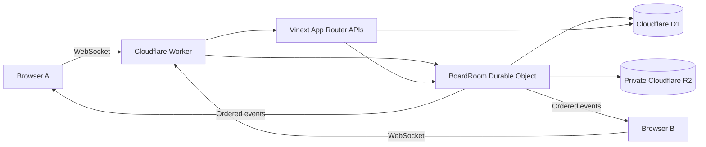

# CollabEdge

[繁體中文](README.zh-TW.md) · **English**

[](https://github.com/happyloa/collab-edge/actions/workflows/ci.yml)

A shared project workspace that makes realtime collaboration explicit: ordered changes, recoverable conflicts, and a clear source of truth.

[Source](https://github.com/happyloa/collab-edge) · [Architecture](docs/architecture.md) · [Protocol](docs/realtime-protocol.md) · [Security and quotas](docs/security.md)

**Deployment:** [CollabEdge on Workers](https://collab-edge.piafyoyo06.workers.dev), protected by owner-only Cloudflare Access email verification. GitHub About contains the same URL. The Worker is connected to this repository through native Workers Builds for `main`; GitHub Actions runs CI separately. Production attachments and preview URLs are disabled. See [delivery status](docs/delivery-status.md) for release verification and remaining testing limits.


## Why this exists

Realtime collaboration is more than broadcasting a new card title. Two people can edit the same field, a connection can disappear after the server commits, and an optimistic screen can briefly disagree with persistent state. CollabEdge explores those boundaries using server authority, edge coordination, explicit revisions and recoverable user input.

## Features

- Workspaces with server-enforced OWNER, EDITOR and VIEWER roles; member invitations, role changes, removal and leaving.
- Boards with columns, cards, descriptions, archive, comments, column ordering and pointer/keyboard card dragging.
- Synchronized board renaming and archival. Archived boards retain history and files, become read-only, and still count toward quotas. The shared demo cannot be archived.
- Hibernating WebSockets, online presence and ordered event delivery.
- Optimistic creation, edits and moves, with explicit pending, failed and conflicted states.
- Per-field conflict detection and a preserved draft with an explicit retry action.
- Reconnect replay, revision-gap detection and snapshot fallback.
- Private, authorized R2 attachments with MIME/signature validation and bounded uploads; enabled locally, gated in production.
- Persistent board activity, light/dark themes, responsive scrolling, keyboard controls and reduced-motion support.
- English and Traditional Chinese interface, including persistent language selection, server-rendered locale, statuses, common errors, accessibility labels and dates. User-authored content stays unchanged.
- Self-hosted Google Fonts Noto Sans TC across the website, with Unicode subsets loaded on demand. [Font source and license](public/fonts/README.md).
- Hard server-side quotas for users, workspaces, boards, messages, mutations, events and attachments.
- Alice and Bob demo sessions with a seeded **Acme Product Team / Website Launch** board.

## Try collaboration locally

Choose **English / 繁體中文** from the language selector on the home, authentication, workspace or board screen. The choice persists for a year using a cookie; English is the default. Switching does not clear drafts or reconnect the board. Cloudflare Access pages and emails are outside this app's localization. See [i18n maintenance](docs/i18n.md).

Start the app, open its home page, and choose **Try as Alice**. Open a private window and choose **Try as Bob**. Both sessions join the same public demo board. Move a card or edit a title and watch the second window update without a reload. Demo identities are editors; they cannot manage members. Keep sensitive information out of the shared demo.

## Architecture



Vinext owns pages, React Server Components and HTTP routes. The custom Worker routes WebSockets and exports DO classes. One BoardRoom per board serializes mutations and allocates revisions. D1 stores canonical entities and events. R2 stores binaries. AuthRateLimiter stores durable counters. Cloudflare Access protects the production hostname; application accounts and sessions are managed internally. There is no external realtime provider.

## Realtime synchronization

Each command has a client-generated UUID and baseRevision. BoardRoom validates and authorizes it, checks conflicts, calculates authoritative ordering, and atomically commits entity changes, the next revision and an event in D1. Only then does it broadcast and acknowledge. A unique board/mutation constraint makes retrying a command safe.

The client keeps confirmed state separate from optimistic commands. Ordered patches reconcile the UI without refetching the entire board after each success. Duplicate events are ignored; revision gaps initiate resynchronization. [Protocol details →](docs/realtime-protocol.md)

## Conflict resolution

Alice opens a card at revision 40. Bob edits its title, creating revision 41. Alice submits an older title based on 40. The server rejects the conflicting field, sends the authoritative snapshot and preserves Alice's attempted value for explicit recovery. A description edit can still succeed if only the title changed. [Rules and examples →](docs/conflict-resolution.md)

## Reconnection

The browser tracks lastSeenRevision and retries with exponential backoff and jitter. The server replays up to 200 contiguous events; absent or unsafe history produces a snapshot. Pending commands retain their mutation IDs. Offline writes are disabled while form drafts remain available. Heartbeat timeout and online/offline events detect broken connections.

## Technology stack

| Layer                              | Installed version            |
| ---------------------------------- | ---------------------------- |
| Vinext / Cloudflare adapter        | 1.0.0-beta.10 / 1.0.0-beta.8 |
| React / React DOM / RSC runtime    | 19.3.0                       |
| Vite / TypeScript                  | 8.3.0 / 6.0.3                |
| Tailwind / Vite integration        | 4.3.3                        |
| Wrangler / Cloudflare Vite plugin  | 4.135.0 / 1.56.0             |
| Drizzle ORM / Kit                  | 0.45.2 / 0.31.10             |
| Zod / TanStack Query               | 4.6.5 / 5.103.1              |
| React Hook Form / resolvers        | 7.88.0 / 5.9.1               |
| dnd-kit core / sortable            | 6.3.1 / 10.0.0               |
| Vitest / Cloudflare test plugin    | 4.1.11 / 1.1.13              |
| Playwright / React Testing Library | 1.63.0 / 16.3.3              |
| ESLint / Prettier / pnpm           | 10.11.0 / 3.9.8 / 12.5.1     |

The exact reproducible graph lives in pnpm-lock.yaml. Compatibility pins, the ESLint bridge and Drizzle loader override are explained in [dependency decisions](docs/dependencies.md).

## Repository structure

```text
app/                 Server pages and App Router HTTP handlers
components/          Interactive auth, workspace, board and UI components
src/auth/            Passwords, sessions, permissions and auth routes
src/i18n/            English/Traditional Chinese UI and error messages
src/db/              Drizzle schema, consistent snapshots and demo data
src/realtime/        Validated protocol, reducers, conflicts and socket client
src/validation/      Upload metadata and signature checks
worker/              Minimal fetch entry and Durable Object coordinators
drizzle/             Committed SQL migrations, constraints and quota triggers
tests/               workerd integration, pure logic and React DOM tests
e2e/                 Independent-browser collaboration scenario
docs/                Architecture, protocol, security, tests and deployment
.github/workflows/   GitHub CI verification; deployment uses Workers Builds
```

## Local development

Use Node.js 24 and pnpm 12.5.1. On Windows, `corepack pnpm` works without a global pnpm shim.

```sh
git clone https://github.com/happyloa/collab-edge.git
cd collab-edge
corepack enable
pnpm install --frozen-lockfile
node scripts/setup-local.mjs
pnpm cf:typegen
pnpm db:migrate:local
pnpm dev
```

The setup script creates a random local SESSION_SECRET and enables only **local** R2. It never overwrites an existing .dev.vars. Open the URL printed by Vinext. Local D1/R2/DO emulation requires no Cloudflare account. Do not add `remote: true` to development bindings.

## Cloudflare setup and deployment

D1 and private R2 were provisioned with Wrangler; their actual configuration is committed. DO exports declare SQLite storage. Use `pnpm cf:typegen` after binding changes, committed SQL migrations for schema changes, and `wrangler secret put SESSION_SECRET` for the runtime secret. The official deployment command is `pnpm run deploy`.

Native Workers Builds verifies the app, checks deployment safety gates, applies remote migrations and deploys pushes to main. GitHub Actions runs CI only. [Exact commands, permissions and release gates →](docs/deployment.md)

## Testing

```sh
pnpm verify
pnpm exec playwright install chromium
pnpm test:e2e
pnpm outdated
pnpm audit
```

Workers integration uses real local workerd, D1, R2 and DOs. Tests cover atomic rollback, idempotency, revision increments, viewer rejection, hibernation, replay and conflict rules. React Testing Library checks UI permissions and validation. The two-browser Playwright test covers synchronization, conflicting edits, reconnect, comments and private attachments, and captures the screenshot above. [Test details →](docs/testing.md)

## Security

PBKDF2-HMAC-SHA256 uses 600,000 iterations, a unique 128-bit salt and a 256-bit result. Sessions use random tokens, HMAC digests, seven-day expiry, server-side logout invalidation and HttpOnly cookies. All write origins and payloads are validated. RBAC is enforced on the server, including event recipients. R2 stays private and downloads are authorized. Persistent rate limits and atomic quotas bound usage. [Parameters, limits and caveats →](docs/security.md)

## Engineering decisions and tradeoffs

- **Vinext:** App Router and React Server Components on Vite, with direct Worker bindings. Its beta compatibility surface remains an upstream risk.
- **Durable Objects:** a natural coordination boundary per board, with explicit serialization across asynchronous I/O and hibernating sockets.
- **D1:** one durable source of truth and atomic event/entity batches. Authorization and broadcast checks consume reads; this favors correctness over maximum fan-out.
- **R2:** private binary storage with random keys. R2 and D1 are not a distributed transaction; crashes can leave inaccessible objects, bounded by the upload budget.
- **Revisions:** understandable conflict and replay semantics without claiming CRDT text merging. Event retention is capped; capacity exhaustion fails closed instead of auto-scaling cost.
- **Cost:** quotas are not an account-wide billing guarantee. The Worker is deployed on the user-confirmed Free plan, with production R2 disabled and owner-only Access enabled.

MVP intentionally omits password reset, application-account email verification, rich-text CRDTs, automated orphan cleanup, event compaction and account deletion. Cloudflare Access email verification is a separate outer gate and does not automatically log users into an application account. Member invitations add existing registered accounts; they do not send email. Owners cannot transfer or relinquish ownership yet. Archived cards remain retained and count toward quotas. The [custom verification email](docs/email/README.md) is a design artifact, not the production Access email.

## Roadmap

CRDT rich text, board templates, notifications, cursor presence, a durable offline write queue, event compaction, owner transfer and organization administration.

## License

MIT © happyloa
