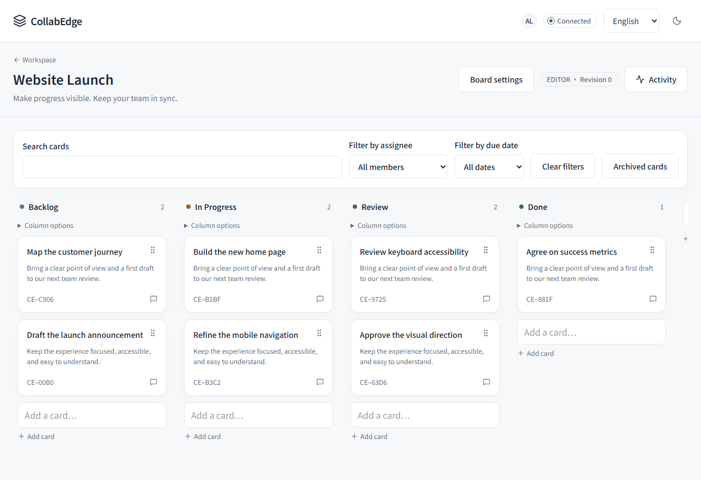
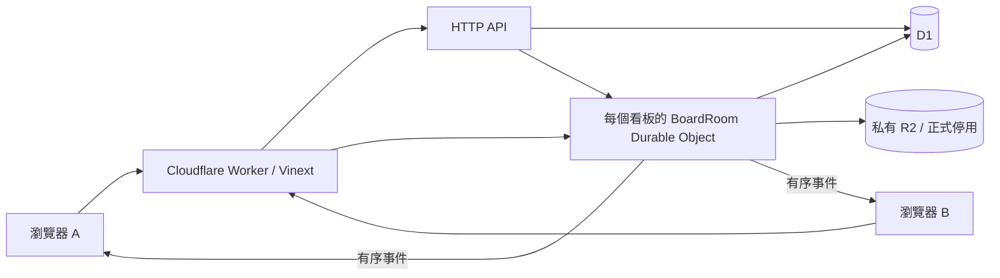

# CollabEdge

**繁體中文** · [English](README.en.md)

[](https://github.com/happyloa/collab-edge/actions/workflows/ci.yml)

讓團隊在同一個看板規劃、討論與即時協作，清楚處理同步、斷線及編輯衝突。

[開啟網站](https://collab-edge.piafyoyo06.workers.dev) · [GitHub](https://github.com/happyloa/collab-edge) · [作品交接與待驗收項目](docs/portfolio-handoff.md) · [交付與驗證紀錄](docs/delivery-status.md)

**[免登入互動展示](https://happyloa.github.io/collab-edge/)**：可編輯、指派、篩選、移動、封存及還原示範卡片，也能模擬隊友修改造成的衝突。展示頁獨立部署在 GitHub Pages，資料只保留在目前分頁，重整或重設即清除，不呼叫正式站 API，也不提供真正的多人連線。頁面下方可[觀看本機雙瀏覽器測試實錄](https://happyloa.github.io/collab-edge/#recorded-collaboration)。[展示頁說明](docs/public-demo.md)。

**真正的即時協作驗證**：參閱[雙瀏覽器測試導覽](docs/realtime-walkthrough.md)，可在本機重現 Alice 和 Bob 透過 Worker、WebSocket 與資料庫同步，並驗證衝突重試及斷線重連。正式站登入後的多人協作仍待擁有者通過 Access 驗收。

> 正式網站目前只允許擁有者通過 Cloudflare Access 信箱驗證後進入。核心功能通過本機與 CI 測試；登入後的正式環境全流程驗收尚未完成。正式附件功能為控制費用而停用。



## 先看這些設計

這個作品把多人協作中容易失敗的情況做成可驗證的行為。可先開啟免登入展示的情境解說，再依[技術架構導覽](docs/architecture.md)追到實際程式碼與測試。

| 問題                                   | 這個作品的做法                                              |
| -------------------------------------- | ----------------------------------------------------------- |
| 兩人同時修改，順序由誰決定？           | 每個看板由一個 Durable Object 協調，D1 保存正式資料與版本。 |
| 資料已寫入，但對方沒有收到通知？       | 資料、版本與事件原子提交；提交後才廣播，重連可重播事件。    |
| 回覆丟失後重試，會不會多建立一張卡片？ | 原操作保留 UUID，伺服器以唯一約束去重。                     |
| 同一欄位被改掉，我剛輸入的內容怎麼辦？ | 按欄位版本檢查衝突，保留草稿並由使用者確認重試。            |
| 如何控制展示環境的用量？               | 伺服器限流、原子配額、部署防護；公開展示在瀏覽器內運行。    |

[架構與資料流](docs/architecture.md)包含提交時序、狀態責任、安全與費用邊界、程式碼導覽，以及仍待完成的工作。首頁與公開展示頁的雙人情境圖是解說模型；真正的 Worker／WebSocket 協作證據見[雙瀏覽器導覽](docs/realtime-walkthrough.md)。

## 專案目的

同一欄位可能被兩人同時編輯，連線可能在伺服器寫入後中斷，畫面上的樂觀更新也可能與資料庫不同步。CollabEdge 使用伺服器決定的版本順序、可重試的操作，以及保留草稿的衝突處理，讓這些情況有明確行為。

## 功能與邊界

| 功能         | 目前狀態                                                                             |
| ------------ | ------------------------------------------------------------------------------------ |
| 帳號與工作區 | 註冊、登入、登出、Access 身分密碼重設、帳號刪除、角色權限與雙方確認的擁有權轉移      |
| 成員管理     | 加入已註冊帳號、調整權限、移除成員；不寄送邀請信                                     |
| 看板與卡片   | 建立看板、改名、封存與還原、欄位管理、拖曳卡片、描述與留言                           |
| 任務管理     | 指派現有工作區成員、截止日期、標題／描述搜尋、負責人及日期篩選                       |
| 即時協作     | WebSocket 同步、使用中／閒置與正在查看的卡片提示、可分頁瀏覽的活動紀錄、樂觀更新     |
| 看板備份還原 | 匯出含版本與校驗碼的 JSON、預覽、成員對應、還原至新看板及中斷續傳                    |
| 衝突與重連   | 欄位衝突提示、保留草稿重試、事件重播與完整快照備援                                   |
| 本機草稿     | 重新整理後可找回卡片修改與未送出留言；七天期限、筆數與容量上限、多分頁隔離及帳號清除 |
| 中英文介面   | English／繁體中文切換，記住選擇，支援伺服器首次渲染                                  |
| 操作體驗     | 深／淺色、手機版、鍵盤操作、GSAP 首頁動態與輕量互動、減少動態效果                    |
| 附件         | 本機可測試私有上傳與下載；正式環境停用                                               |
| 客製驗證信   | [HTML、純文字與預覽](docs/email/README.md)已完成，尚未串接 Access 寄信               |

Cloudflare Access 是外層門禁，通過後仍需登入 CollabEdge 帳號或使用示範身分。工作區成員設定不會自動授予外層門禁權限。

草稿保存在目前瀏覽器，恢復後由使用者確認再送出；不確定是否已提交的修改會保留原 UUID，避免重複寫入。登出、重設密碼、刪除帳號或切換帳號後會清除裝置草稿。瀏覽器若禁止儲存，介面會保留輸入並停止送出看板修改；完整離線重新載入目前不支援。詳見[本機草稿與限制](docs/local-drafts.md)。

工作區擁有者可查看成員、看板、卡片、留言與累計修改的容量。封存資料仍計入配額，容量頁面不會刪除資料或重設上限。詳見[工作區容量](docs/workspace-capacity.md)。

擁有者可在「活動紀錄 → 管理歷史紀錄」清除超過 30 天、且不在最近 200 次修改內的事件內容，每次最多 100 筆。操作 UUID、目前看板資料及累計配額保留；回覆遺失後重試仍使用原批次。這不會重設容量，JSON 備份也不能恢復清除的活動。[保留規則與清理後還原演練](docs/event-retention.md)。

看板 JSON 匯出不會向 Cloudflare 發出額外請求，只有連線已同步且沒有待確認編輯時可使用。新版備份包含格式版本與校驗碼；工作區擁有者可預覽資料、對應指派成員，並還原為新看板，中斷後也能選取同一份檔案續傳。備份不含附件檔案本體或完整事件歷史，還原後的附件只顯示無法下載的參照。[還原流程與容量限制](docs/board-backups.md)。

首頁動畫的設計來源與取捨見[動態設計參考](docs/motion-references.md)。

在工作區勾選「顯示已封存看板」即可進入並還原看板；卡片可從「已封存卡片」清單還原。封存資料仍計入原有配額，還原不會清除描述、留言或附件紀錄。搜尋與篩選期間暫停拖曳，清除篩選後恢復。截止日期採日曆日期，逾期／今日篩選依瀏覽器當地日期判斷，尚無到期通知。

## 切換語言

全站使用 Google Fonts 的 **Noto Sans TC（思源黑體）**，中英文及表單控制項皆套用同一字型。字型自行託管，依頁面字元載入需要的分段；[來源與開源授權](public/fonts/README.md)隨專案附上。

首頁、登入／註冊頁、工作區與看板都有 **Language / 語言** 選單。選擇 English 或繁體中文後立即更新介面，不重新載入看板，也不清除輸入中的草稿。

選擇會儲存於 `collabedge_locale` cookie，保留一年。重新整理與切換頁面後仍使用所選語言，未設定時預設英文。按鈕、欄位、提示、常見錯誤、權限、連線狀態與活動名稱皆有翻譯；日期時間使用所選語系格式。

卡片、留言、工作區名稱、檔名等使用者資料保留原文。Cloudflare Access 的外部登入頁與寄信不由本專案的語言選單控制。翻譯維護方式見 [i18n 文件](docs/i18n.md)。

## 本機啟動

使用 Node.js 24 與 pnpm **12.5.1**。Windows 可用 `corepack pnpm`，不必另外安裝全域 pnpm。

```sh
git clone https://github.com/happyloa/collab-edge.git
cd collab-edge
corepack pnpm install --frozen-lockfile
node scripts/setup-local.mjs
corepack pnpm cf:typegen
corepack pnpm db:migrate:local
corepack pnpm dev
```

開啟終端機顯示的網址。設定腳本會建立 `.dev.vars`，分別產生本機 `SESSION_SECRET`、`SESSION_SIGNING_KEY` 與 `PASSWORD_PEPPERS`，啟用本機附件並停用本機 Access 門禁。三組密鑰彼此獨立，腳本不覆蓋既有檔案；若沿用較早的設定，請依[密鑰設定與輪替文件](docs/auth-key-rotation.md)補齊，勿複製正式環境密鑰。D1、R2 與 Durable Objects 在本機模擬，不需要 Cloudflare 帳號；請勿將開發 bindings 改成遠端資料來源。

在一般視窗選 **Try as Alice／以 Alice 體驗**，在無痕視窗選 **Try as Bob／以 Bob 體驗**，即可進入相同的 Website Launch 示範看板。修改卡片時，另一個視窗會即時更新。示範身分皆為編輯者，請勿輸入敏感資料。

## 系統架構


```mermaid
flowchart LR
    A[瀏覽器 A] --> W[Cloudflare Worker / Vinext]
    B[瀏覽器 B] --> W
    W --> H[HTTP API]
    W --> D[每個看板的 BoardRoom Durable Object]
    H --> DB[(D1)]
    H --> D
    D --> DB
    D --> R[(私有 R2 / 正式停用)]
    D -->|有序事件| A
    D -->|有序事件| B
```

Vinext 處理頁面與 HTTP API。每個看板由一個 BoardRoom 序列化變更；D1 保存正式資料及事件。R2 儲存附件，AuthRateLimiter 保存使用量計數。

每次操作附上唯一 `clientMutationId` 與 `baseRevision`。伺服器在同一筆 D1 transaction 中更新資料、版本與事件，再廣播結果。重送相同操作不會重複寫入。整欄拖曳排序以單一 SQL 更新受影響卡片的位置，避免在 Workers Free 上為每張卡片各執行一次查詢；變動的資料列仍計入 D1 每日寫入額度。事件及在線名單廣播以一筆 D1 查詢重新確認所有接收者的權限；單一看板最多 20 條連線。

例如 Alice 開啟版本 40 的卡片，Bob 修改標題後成為版本 41；Alice 再以舊版本修改同一標題時，系統會提示衝突並保留草稿。重連時依最後版本補回事件，無法安全重播則取得完整快照。這不是 CRDT 文字合併，也沒有長期離線寫入佇列。

## 技術與目錄

Vinext 1.0.1、React 19.3.0、Vite 8.3.2、TypeScript 6.0.3、Tailwind CSS 4.3.3，搭配 Drizzle、Zod、TanStack Query 與 dnd-kit。實際鎖定版本以 [package.json](package.json) 與 [pnpm-lock.yaml](pnpm-lock.yaml) 為準；相容性取捨見 [dependencies.md](docs/dependencies.md)。

| 目錄                   | 用途                          |
| ---------------------- | ----------------------------- |
| `app/`、`components/`  | 頁面、API 與互動介面          |
| `src/auth/`、`src/db/` | 身分驗證、權限與資料模型      |
| `src/realtime/`        | 同步協定、衝突與重連          |
| `src/i18n/`            | 中英文文案與錯誤翻譯          |
| `worker/`              | Worker 入口與 Durable Objects |
| `drizzle/`             | 不可改寫的已套用 migrations   |
| `tests/`、`e2e/`       | Workers、React 及瀏覽器測試   |
| `docs/`                | 架構、部署、安全與驗證文件    |

## 驗證與部署

```sh
corepack pnpm verify
corepack pnpm exec playwright install chromium firefox webkit
corepack pnpm test:e2e
corepack pnpm test:perf
corepack pnpm audit
```

`verify` 包含格式、lint、型別、Workers／React 測試、Vinext 相容性與正式建置。Playwright 使用 Chromium 驗證完整功能，另用 Firefox／WebKit 驗證登入導航、鍵盤對話框與歷史維護。`test:e2e` 每次會自動建立、遷移並清理獨立的本機測試資料，不消耗平常開發資料庫的配額。測試在本機模擬環境執行；正式站登入、實機瀏覽器與讀屏仍須另外驗收。

`test:perf` 量測 25／100／200 張卡片、最多 4,000 則留言的本機 Chromium 看板，記錄快照大小、繪製與互動時間，並確認鍵盤移動寫入 D1、留言完整保留。數據與限制見[大型看板基準](docs/snapshot-performance.md)；桌面與手機的焦點、未存提示和減少動態驗收見[鍵盤操作](docs/keyboard-accessibility.md)。正式站延遲仍需登入後另外確認。

GitHub Actions 負責 CI、CodeQL 與獨立展示頁發布；Cloudflare 原生 Workers Builds 連接本 repo，在符合路徑條件的 `main` 更新時，先執行高風險套件稽核與 `verify`，通過費用防護檢查後才套用遠端 migrations 並部署。純 README 與 `docs/` 修改不觸發 Worker 建置。不要另外啟用第二套自動部署。完整操作、bindings、權限與安全檢查見 [部署文件](docs/deployment.md)。GitHub About 已設定正式網址。

目前仍由 `wrangler.jsonc` 與 Vinext Cloudflare adapter 管理開發、建置及部署；帳號與資源管理優先使用官方 `cf` CLI。建議另行完成 `cf` 遷移，目前 adapter 整合與遷移 TODO 尚未驗證，不能只替換命令。正式驗證需三組獨立密鑰；已使用的 `SESSION_SECRET` 保留供舊帳號相容，不應在一般部署中重建。詳見[密鑰設定與輪替](docs/auth-key-rotation.md)。

## 安全、用量與已知限制

新密碼使用獨立 pepper、100,000 次 PBKDF2-HMAC-SHA256、隨機鹽值與 256-bit 結果；工作區權限、Access 門禁與持續限流共同限制存取。密碼雜湊參數的安全取捨見[安全文件](docs/security.md)。Session 使用獨立簽章密鑰及 HttpOnly cookie；所有寫入、WebSocket 與附件存取均在伺服器驗證權限。正式環境僅允許擁有者信箱進站，Workers Free 由擁有者確認，未升級付費方案。

系統設有每 IP 限流、每 24 小時最多 5,000 次動態請求、每日 2,000 次看板變更，以及工作區、卡片、事件與檔案配額。超過上限會拒絕操作；封存資料仍占配額。應用程式限制不是整個 Cloudflare 帳戶的帳單保證。

正式網站的新帳號必須使用 Cloudflare Access 已驗證的信箱註冊。既有帳號可先登入，再於工作區畫面改用該信箱；示範帳號不能改用正式信箱。Access 是外層門禁，不會自動登入應用程式帳號。已登入者進入登入／註冊頁時會回到工作區。

- **密碼重設**：[重設頁面](app/reset-password/page.tsx)核對同一個有效的 Access 身分，重設後撤銷所有舊的應用程式登入階段。流程不另外寄送新驗證碼；未設定 Access 的本機環境不能使用。
- **擁有權轉移**：擁有者向現有成員提出邀請，雙方各自輸入帳號密碼，接收者須於七天內登入接受。邀請不寄信，也不授予外層 Access 權限；示範帳號不能轉移。
- **帳號刪除與資料保留**：非示範帳號先轉移所有工作區擁有權，再輸入密碼刪除。登入資料與成員資格會移除，共享的卡片、留言與檔案保留，作者匿名化。已刪除帳號仍占終身帳號總額；封存資料仍占配額。目前沒有自動清理孤立附件或事件壓縮。
- **尚待驗收**：擁有者登入正式站後的完整流程、多瀏覽器、慢速裝置與螢幕閱讀器驗收仍未完成。本機與 CI 通過不代表這些項目已完成，詳見[作品交接](docs/portfolio-handoff.md)。
- **安全稽核例外**：`braces@3.0.3` 的既有高風險公告使用本機修補、回歸測試及明列的稽核例外。相容性限制與修補依據見[套件文件](docs/dependencies.md)。
- **後續功能**：富文字共同編輯、看板範本、通知、游標同步、長期離線寫入及組織管理尚未實作。Vinext 使用穩定版 1.0.1，升級前仍需驗證相容性。

## 延伸文件

- [API 與登入錯誤恢復](docs/error-recovery.md)：註冊交易、錯誤分類、保留輸入與同帳號重連
- [作品交接與待驗收項目](docs/portfolio-handoff.md)：目前交付範圍、測試證據與正式環境限制
- [專案審查與改善順序](docs/project-review.md)：審查時的問題與驗收準則，完成狀態以交接文件為準
- [驗證密鑰設定與輪替](docs/auth-key-rotation.md)：獨立密鑰、舊帳號相容與部署程序
- [架構](docs/architecture.md)、[即時協定](docs/realtime-protocol.md)、[衝突處理](docs/conflict-resolution.md)
- [安全與配額](docs/security.md)、[測試](docs/testing.md)、[部署](docs/deployment.md)
- [交付狀態與未完成驗收](docs/delivery-status.md)、[開發規則](AGENTS.md)

## 授權

[MIT](LICENSE) © happyloa
