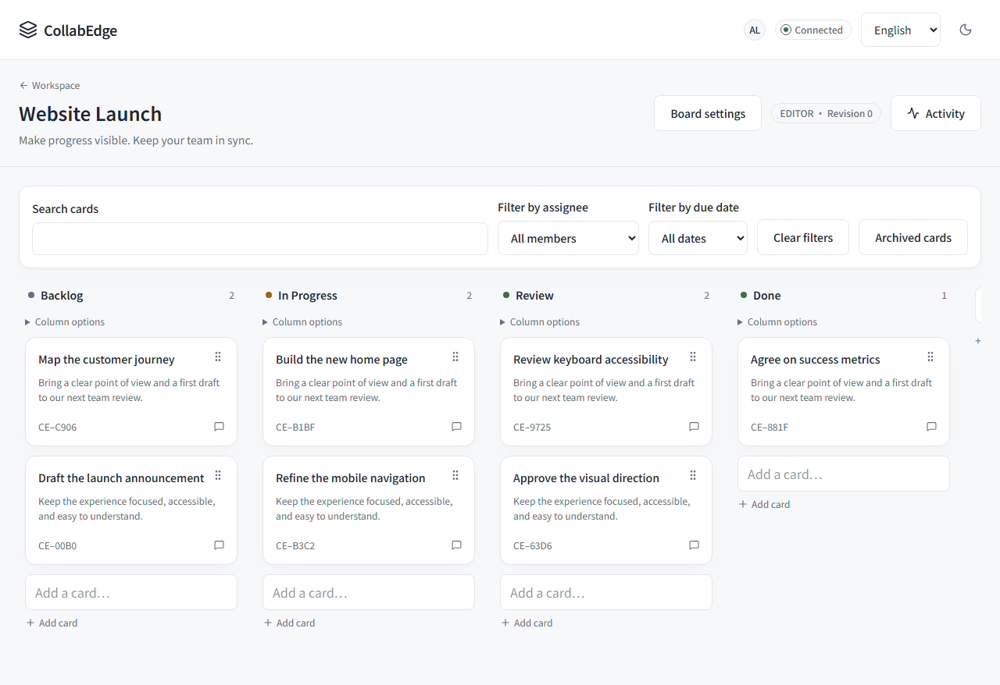
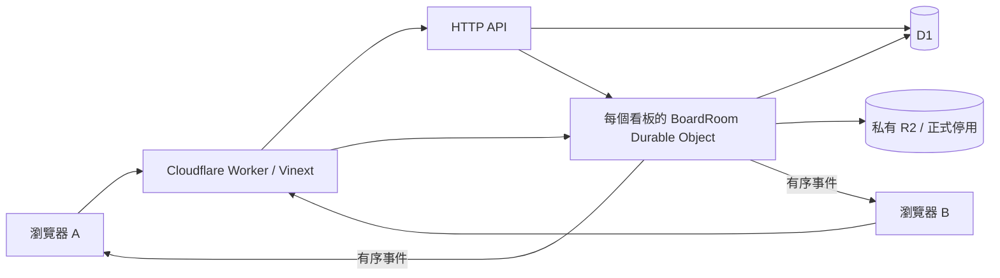

# CollabEdge

**繁體中文** · [English](README.md)

[](https://github.com/happyloa/collab-edge/actions/workflows/ci.yml)

讓團隊在同一個看板規劃、討論與即時協作，清楚處理同步、斷線及編輯衝突。

[開啟網站](https://collab-edge.piafyoyo06.workers.dev) · [GitHub](https://github.com/happyloa/collab-edge) · [交付與驗證紀錄](docs/delivery-status.md)

**[免登入互動展示](https://happyloa.github.io/collab-edge/)**：可編輯、指派、篩選、移動、封存及還原示範卡片，也能模擬隊友修改造成的衝突。展示頁獨立部署在 GitHub Pages，資料只保留在目前分頁，重整或重設即清除，不呼叫正式站 API，也不提供真正的多人連線。[展示頁說明](docs/public-demo.md)。

> 正式網站目前只允許擁有者通過 Cloudflare Access 信箱驗證後進入。核心功能通過本機與 CI 測試；登入後的正式環境全流程驗收尚未完成。正式附件功能為控制費用而停用。



## 專案目的

即時協作不只是廣播畫面變更。同一欄位可能被兩人同時編輯，連線可能在伺服器寫入後中斷，畫面上的樂觀更新也可能與資料庫不同步。CollabEdge 使用伺服器決定的版本順序、可重試的操作，以及保留草稿的衝突處理，讓這些情況有明確行為。

## 功能與邊界

| 功能         | 目前狀態                                                               |
| ------------ | ---------------------------------------------------------------------- |
| 帳號與工作區 | 註冊、登入、登出、帳號刪除、角色權限與雙方確認的擁有權轉移             |
| 成員管理     | 加入已註冊帳號、調整權限、移除成員；不寄送邀請信                       |
| 看板與卡片   | 建立看板、改名、封存與還原、欄位管理、拖曳卡片、描述與留言             |
| 任務管理     | 指派現有工作區成員、截止日期、標題／描述搜尋、負責人及日期篩選         |
| 即時協作     | WebSocket 同步、在線狀態、可分頁瀏覽的活動紀錄、樂觀更新               |
| 看板資料匯出 | 在瀏覽器下載已同步看板的 JSON，含卡片、留言及附件中繼資料              |
| 衝突與重連   | 欄位衝突提示、保留草稿重試、事件重播與完整快照備援                     |
| 中英文介面   | English／繁體中文切換，記住選擇，支援伺服器首次渲染                    |
| 操作體驗     | 深／淺色、手機版、鍵盤操作、GSAP 首頁動態與輕量互動、減少動態效果      |
| 附件         | 本機可測試私有上傳與下載；正式環境停用                                 |
| 客製驗證信   | [HTML、純文字與預覽](docs/email/README.md)已完成，尚未串接 Access 寄信 |

Cloudflare Access 是外層門禁，通過後仍需登入 CollabEdge 帳號或使用示範身分。工作區成員設定不會自動授予外層門禁權限。

看板 JSON 匯出不會向 Cloudflare 發出額外請求，只有連線已同步且沒有待確認編輯時可使用。匯出內容不含附件檔案本體或完整事件歷史，目前也不提供匯入，因此不能視為完整備份。

首頁動畫的設計來源與取捨見[動態設計參考](docs/motion-references.md)。

在工作區勾選「顯示已封存看板」即可進入並還原看板；卡片可從「已封存卡片」清單還原。封存資料仍計入原有配額，還原不會清除描述、留言或附件紀錄。搜尋與篩選期間暫停拖曳，清除篩選後恢復。截止日期採日曆日期，逾期／今日篩選依瀏覽器當地日期判斷，尚無到期通知。

## 切換語言

全站使用 Google Fonts 的 **Noto Sans TC（思源黑體）**，中英文及表單控制項皆套用同一字型。字型自行託管，依頁面字元載入需要的分段；[來源與開源授權](public/fonts/README.md)隨專案附上。

首頁、登入／註冊頁、工作區與看板都有 **Language / 語言** 選單。選擇 English 或繁體中文後立即更新介面，不重新載入看板，也不清除輸入中的草稿。

選擇會儲存於 `collabedge_locale` cookie，保留一年。重新整理與切換頁面後仍使用所選語言，未設定時預設英文。按鈕、欄位、提示、常見錯誤、權限、連線狀態與活動名稱皆有翻譯；日期時間使用所選語系格式。

卡片、留言、工作區名稱、檔名等使用者資料保留原文。Cloudflare Access 的外部登入頁與寄信不由本專案的語言選單控制。翻譯維護方式見 [i18n 文件](docs/i18n.md)。

## 本機啟動

使用 Node.js 24 與 pnpm **12.5.1**。Windows 可用 `corepack pnpm`，不必另外安裝全域 pnpm。

```sh
git clone https://github.com/happyloa/collab-edge.git
cd collab-edge
corepack pnpm install --frozen-lockfile
node scripts/setup-local.mjs
corepack pnpm cf:typegen
corepack pnpm db:migrate:local
corepack pnpm dev
```

開啟終端機顯示的網址。設定腳本會產生隨機的本機 SESSION_SECRET，啟用本機附件並停用本機 Access 門禁，不覆蓋既有 `.dev.vars`。D1、R2 與 Durable Objects 在本機模擬，不需要 Cloudflare 帳號；請勿將開發 bindings 改成遠端資料來源。

在一般視窗選 **Try as Alice／以 Alice 體驗**，在無痕視窗選 **Try as Bob／以 Bob 體驗**，即可進入相同的 Website Launch 示範看板。修改卡片時，另一個視窗會即時更新。示範身分皆為編輯者，請勿輸入敏感資料。

## 系統架構



Vinext 處理頁面與 HTTP API。每個看板由一個 BoardRoom 序列化變更；D1 保存正式資料及事件。R2 儲存附件，AuthRateLimiter 保存使用量計數。

每次操作附上唯一 `clientMutationId` 與 `baseRevision`。伺服器在同一筆 D1 transaction 中更新資料、版本與事件，再廣播結果。重送相同操作不會重複寫入。整欄拖曳排序以單一 SQL 更新受影響卡片的位置，避免在 Workers Free 上為每張卡片各執行一次查詢；變動的資料列仍計入 D1 每日寫入額度。事件及在線名單廣播以一筆 D1 查詢重新確認所有接收者的權限；單一看板最多 20 條連線。

例如 Alice 開啟版本 40 的卡片，Bob 修改標題後成為版本 41；Alice 再以舊版本修改同一標題時，系統會提示衝突並保留草稿。重連時依最後版本補回事件，無法安全重播則取得完整快照。這不是 CRDT 文字合併，也沒有長期離線寫入佇列。

## 技術與目錄

Vinext 1.0.0-beta.10、React 19.3.0、Vite 8.3.0、TypeScript 6.0.3、Tailwind CSS 4.3.3，搭配 Drizzle、Zod、TanStack Query 與 dnd-kit。實際鎖定版本以 [package.json](package.json) 與 [pnpm-lock.yaml](pnpm-lock.yaml) 為準；相容性取捨見 [dependencies.md](docs/dependencies.md)。

| 目錄                   | 用途                          |
| ---------------------- | ----------------------------- |
| `app/`、`components/`  | 頁面、API 與互動介面          |
| `src/auth/`、`src/db/` | 身分驗證、權限與資料模型      |
| `src/realtime/`        | 同步協定、衝突與重連          |
| `src/i18n/`            | 中英文文案與錯誤翻譯          |
| `worker/`              | Worker 入口與 Durable Objects |
| `drizzle/`             | 不可改寫的已套用 migrations   |
| `tests/`、`e2e/`       | Workers、React 及瀏覽器測試   |
| `docs/`                | 架構、部署、安全與驗證文件    |

## 驗證與部署

```sh
corepack pnpm verify
corepack pnpm exec playwright install chromium
corepack pnpm test:e2e
corepack pnpm audit
```

`verify` 包含格式、lint、型別、Workers／React 測試、Vinext 相容性與正式建置。Playwright 另驗證雙人協作、衝突、重連、手機版、主題與語言切換。測試使用本機模擬環境，不等同正式環境登入後驗收。

GitHub Actions 負責 CI；Cloudflare 原生 Workers Builds 連接本 repo，在 `main` 更新時驗證、套用遠端 migrations 並部署。不要另外啟用第二套自動部署。完整操作、bindings、權限與安全檢查見 [部署文件](docs/deployment.md)。GitHub About 已設定正式網址。

## 安全、用量與已知限制

密碼使用 PBKDF2-HMAC-SHA256，Session 使用 HttpOnly cookie；所有寫入、WebSocket 與附件存取均在伺服器驗證權限。正式環境僅允許擁有者信箱進站，Workers Free 由擁有者確認，未升級付費方案。

系統設有每 IP 限流、每 24 小時最多 5,000 次動態請求、每日 2,000 次看板變更，以及工作區、卡片、事件與檔案配額。超過上限會拒絕操作；封存資料仍占配額。應用程式限制不是整個 Cloudflare 帳戶的帳單保證。

正式網站的新帳號必須使用 Cloudflare Access 已驗證的信箱註冊。既有帳號可先登入，再於工作區畫面改用 Access 已驗證的信箱；示範帳號不能改用正式信箱。[密碼重設頁](app/reset-password/page.tsx)以同一個 Access 身分核對帳號，並撤銷所有舊的應用程式登入階段。有效的 Access 登入階段即可重設，不會另外寄送一次新驗證碼；未設定 Access 的本機環境不能使用重設功能。Access 仍是外層門禁，不會自動登入應用程式帳號。工作區擁有者可向現有成員提出轉移邀請；雙方須各自輸入帳號密碼，接收者須於七天內登入接受。正式站外層仍只允許擁有者指定信箱通過 Access，轉移邀請不會寄信，示範帳號無法轉移。非示範帳號可在先轉移所有工作區擁有權後，輸入密碼刪除帳號；系統會移除登入資料與成員資格，但已分享的卡片、留言及檔案會保留，作者資料匿名化。已刪除帳號仍占用終身帳號總額。尚未提供自動清理孤立附件與事件壓縮。富文字共同編輯、看板範本、通知、游標同步及組織管理是未來方向。Vinext 仍為 beta，升級前需驗證相容性。

## 延伸文件

- [架構](docs/architecture.md)、[即時協定](docs/realtime-protocol.md)、[衝突處理](docs/conflict-resolution.md)
- [安全與配額](docs/security.md)、[測試](docs/testing.md)、[部署](docs/deployment.md)
- [交付狀態與未完成驗收](docs/delivery-status.md)、[開發規則](AGENTS.md)

## 授權

[MIT](LICENSE) © happyloa
