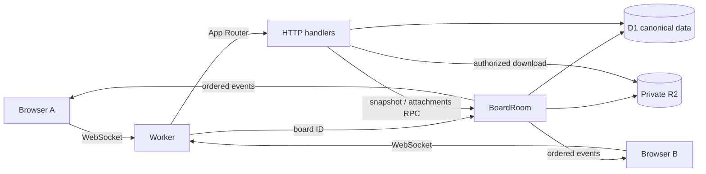
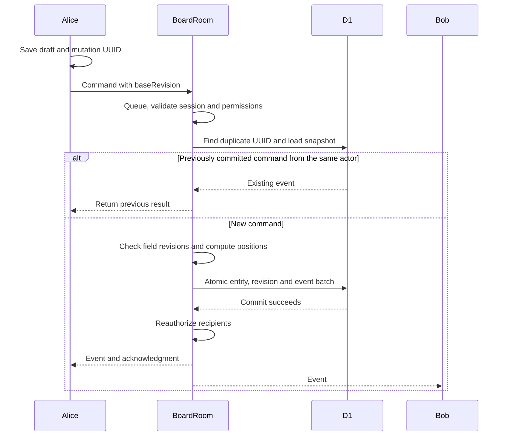

# Architecture

[????](architecture.md) ? **English**

CollabEdge uses Vinext App Router, React Server Components, Vite 8 and Workers. The custom Worker only routes `/realtime/:boardId` and exports Durable Objects. App Router owns all ordinary HTTP APIs.

One SQLite-backed BoardRoom coordinates each board. A promise queue serializes socket messages, snapshots and attachment operations across asynchronous D1 calls. Durable Object storage is not a canonical board database. D1 contains normalized entities, per-field revision metadata and the event log.

Every successful mutation batches the entity changes, board revision and event insert. A CHECK constraint guard aborts a stale revision; unique `(board_id, revision)` and `(board_id, client_mutation_id)` indexes protect ordering and deduplication. Broadcast and acknowledgment occur after persistence. A crash between commit and broadcast is repaired by replay; clients reuse mutation IDs when retrying uncertain commands.

SQL triggers enforce cross-object quotas atomically. Per-board limits are checked inside the serialized coordinator. Workspace management, membership changes and board creation guard the current role inside the same D1 batch as their write, so a concurrent ownership or membership change cannot authorize a stale HTTP mutation. Password-confirmed ownership transfer also validates the same account password hash and active app session at commit time. AuthRateLimiter uses persistent SQLite counters. Presence lives in hibernatable socket attachments, not D1. Recipients are reauthorized before board event broadcasts.

HTTP snapshots use a D1 batch and pass through the board queue, preventing a snapshot from mixing different revisions. React Query manages workspace/session-independent HTTP reads; the realtime reducer owns board state.

R2 and D1 cannot participate in one distributed transaction. Uploads reserve a conservative lifetime byte budget, write a random R2 key, and commit metadata plus a board event. Failure attempts to remove the object. An abrupt process failure can leave an inaccessible orphan; the byte budget still bounds it. Deletion commits metadata removal before deleting the object, so a failure cannot leave an accessible file.

Limits and deployment gates are documented in [security](security.md) and [deployment](deployment.md).

The public [interactive demo](public-demo.md) is a separate Vite build on GitHub Pages. It imports only the pure mutation, event and filter logic plus shared UI styling and translations. Its cards stay in browser memory; it does not contact D1, Durable Objects, R2 or Worker APIs. The production Worker remains behind owner-only Cloudflare Access.

## State ownership

| Location                        | Responsibility                                                                                        |
| ------------------------------- | ----------------------------------------------------------------------------------------------------- |
| D1                              | Canonical entities, sessions, field revisions, events and atomic quota counters                       |
| BoardRoom memory                | A Promise queue serializing mutations, snapshots and attachment work across asynchronous calls        |
| DO storage / socket attachments | Persistent counters, coordination and hibernatable presence; not a second board database              |
| Browser                         | Confirmed snapshot and pending commands; optimistic rendering never allocates authoritative revisions |
| IndexedDB                       | Bounded, expiring drafts isolated by account, board and tab; restored changes need explicit review    |
| Private R2                      | Attachment binaries; local testing enabled, production disabled                                       |

TanStack Query manages workspace and account HTTP reads. The realtime hook and pure reducer own the board, keeping competing state managers out of its mutation path.

## A committed change

The unique board/mutation constraint prevents duplicate writes. A retry retains the original UUID and must belong to the same actor. Column ordering uses one JSON-expanded SQL update, but every changed row still counts toward D1's write allowance.

| Failure                                            | Recovery                                                                     |
| -------------------------------------------------- | ---------------------------------------------------------------------------- |
| A field changed after the command's base revision  | Send a conflict snapshot and keep the user's attempted draft                 |
| A database guard or quota fails                    | Roll back the complete batch; no partial change is broadcast                 |
| A reply is lost after commit                       | Retry the UUID for the existing result; replay helps other browsers catch up |
| Reconnection misses contiguous recent events       | Replay up to 200 events after checking the complete sequence                 |
| Missing history, excessive gap or invalid revision | Load a consistent snapshot through the board queue and D1 batch              |
| Draft storage is unavailable                       | Preserve form input and block submission rather than assume persistence      |

Offline form drafts are supported; a durable automatic offline write queue and CRDT text merging are not implemented.

## Safety and deployment boundaries

The Worker validates Access at HTTP requests and WebSocket handshakes. Each socket frame rechecks the app session and board permissions; this is not a fresh Access JWT validation for every frame. Broadcasts batch-check recipients and stop delivery if authorization lookup fails. Workspace management guards its current role within the write batch. Password and session keys are independent; see [key rotation](auth-key-rotation.md).

The HTTP budget includes socket handshakes, not every frame. Frames have their own limits: 60 messages per minute per connection, 20 sockets per board and 2,000 site-wide mutations per day. Dynamic requests are capped at 5,000 per 24-hour window. Server guards fail closed. The user's Free-plan confirmation is not independent billing verification or an account-wide cost guarantee.

Native Workers Builds runs the high audit and `verify` before safety gates, migrations and deployment. GitHub separately runs CI, CodeQL and the public demo workflow. Wrangler/Vinext remains the verified build and deploy integration; account resource operations prefer official `cf`. A full CLI migration remains pending.

Backups include a version and checksum, support owner-reviewed restore into a new board and resume interrupted transfers. Binary files and old event history are excluded. Archiving retains quota usage; account deletion preserves shared content with an anonymous author. [Backup limits](board-backups.md).

Owners can clear old event payloads in reviewed batches of at most 100, keeping the latest 200 revisions and all UUID receipts. Ownership and revision guards commit with compaction; lost-response retries keep the original range. A pruned mutation retry returns a snapshot and its original acknowledgment instead of writing or broadcasting again. Lifetime budgets stay unchanged. The [retention guide](event-retention.md) includes the local post-compaction restore drill and its limits.

## Read the implementation

1. [Protocol](../src/realtime/protocol.ts), [mutation rules](../src/realtime/mutations.ts) and [pure reducer](../src/realtime/board-reducer.ts).
2. [BoardRoom](../worker/durable-objects/BoardRoom.ts) and [consistent snapshot query](../src/db/queries/snapshot.ts).
3. [Socket client](../src/realtime/socket-client.ts) and [draft store](../src/drafts/store.ts).
4. [Testing guide](testing.md) and [real local two-browser walkthrough](realtime-walkthrough.md).

The homepage and public demo include an illustrated, browser-only scenario selector. It explains synchronization, conflicts and reconnection without representing a live socket connection. The [motion reference](motion-references.md) records the design sources and accessibility boundaries.

## Remaining priorities

Owner-authenticated production acceptance remains pending. Local workerd, CI and an anonymous Access redirect do not prove it. Manual event compaction and the board restore drill are implemented; database-wide disaster recovery, orphan cleanup and quota recovery need further work. Firefox/WebKit now cover sign-in navigation, keyboard dialogs and history maintenance. Slow devices, real hardware, screen readers and privacy-aware operational metrics need broader validation. See [portfolio handoff](portfolio-handoff.md) for delivery evidence; the named, locally patched braces high audit exception remains documented in [dependencies](dependencies.md).
