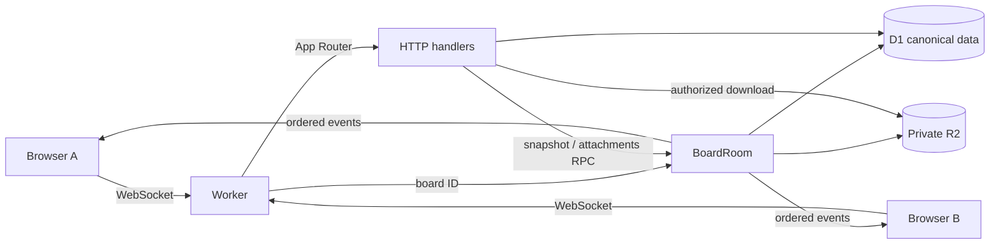

# Architecture

CollabEdge uses Vinext App Router, React Server Components, Vite 8 and Workers. The custom Worker only routes `/realtime/:boardId` and exports Durable Objects. App Router owns all ordinary HTTP APIs.

One SQLite-backed BoardRoom coordinates each board. A promise queue serializes socket messages, snapshots and attachment operations across asynchronous D1 calls. Durable Object storage is not a canonical board database. D1 contains normalized entities, per-field revision metadata and the event log.

Every successful mutation batches the entity changes, board revision and event insert. A CHECK constraint guard aborts a stale revision; unique `(board_id, revision)` and `(board_id, client_mutation_id)` indexes protect ordering and deduplication. Broadcast and acknowledgment occur after persistence. A crash between commit and broadcast is repaired by replay; clients reuse mutation IDs when retrying uncertain commands.

SQL triggers enforce cross-object quotas atomically. Per-board limits are checked inside the serialized coordinator. Workspace management, membership changes and board creation guard the current role inside the same D1 batch as their write, so a concurrent ownership or membership change cannot authorize a stale HTTP mutation. Password-confirmed ownership transfer also validates the same account password hash and active app session at commit time. AuthRateLimiter uses persistent SQLite counters. Presence lives in hibernatable socket attachments, not D1. Recipients are reauthorized before board event broadcasts.

HTTP snapshots use a D1 batch and pass through the board queue, preventing a snapshot from mixing different revisions. React Query manages workspace/session-independent HTTP reads; the realtime reducer owns board state.

R2 and D1 cannot participate in one distributed transaction. Uploads reserve a conservative lifetime byte budget, write a random R2 key, and commit metadata plus a board event. Failure attempts to remove the object. An abrupt process failure can leave an inaccessible orphan; the byte budget still bounds it. Deletion commits metadata removal before deleting the object, so a failure cannot leave an accessible file.

Limits and deployment gates are documented in [security](security.md) and [deployment](deployment.md).

The public [interactive demo](public-demo.md) is a separate Vite build on GitHub Pages. It imports only the pure mutation, event and filter logic plus shared UI styling and translations. Its cards stay in browser memory; it does not contact D1, Durable Objects, R2 or Worker APIs. The production Worker remains behind owner-only Cloudflare Access.
