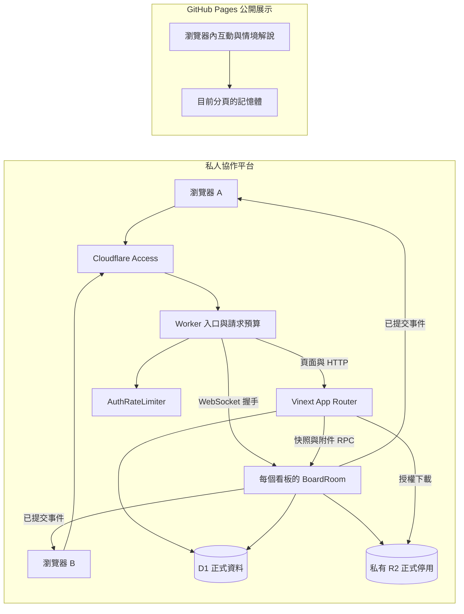
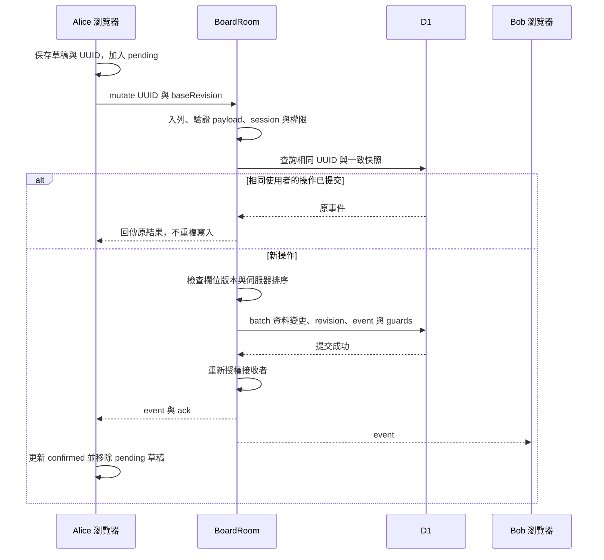

# CollabEdge 技術架構

**繁體中文** · [English](architecture.en.md)

CollabEdge 是在 Cloudflare Workers 上運行的多人協作看板。這份文件從「兩個人同時修改一張卡片」出發，說明資料由誰決定、提交失敗怎麼處理，以及系統為何拆成 HTTP、Durable Object 與 D1。內容對照目前程式碼；正式環境登入後的驗收邊界見[作品交接](portfolio-handoff.md)。

## 核心設計

| 設計                   | 解決的問題                                   | 實作入口                                                                                                               |
| ---------------------- | -------------------------------------------- | ---------------------------------------------------------------------------------------------------------------------- |
| 每個看板一個 BoardRoom | 多個瀏覽器的非同步操作需要明確順序           | [BoardRoom](../worker/durable-objects/BoardRoom.ts)                                                                    |
| D1 原子批次            | 資料、版本與事件不能只寫入一部分             | [SQL migrations](../drizzle/)、[資料模型](../src/db/schema/index.ts)                                                   |
| 操作 UUID 與欄位版本   | 不確定的操作可以重試，同欄位修改需要提示衝突 | [協定](../src/realtime/protocol.ts)、[變更規則](../src/realtime/mutations.ts)                                          |
| 確認狀態與草稿分離     | 樂觀畫面不能取代伺服器結果，失敗時要保留輸入 | [連線與狀態](../src/realtime/socket-client.ts)、[草稿儲存](../src/drafts/store.ts)                                     |
| 事件重播與快照備援     | 斷線後補回變更，避免把不同版本混在一起       | [快照讀取](../src/db/queries/snapshot.ts)、[事件 reducer](../src/realtime/board-reducer.ts)                            |
| 有界用量與獨立展示     | 履歷展示需要可試用，同時限制正式資源消耗     | [限流](../src/lib/request-budget.ts)、[部署防護](../scripts/check-deploy-budget.mjs)、[公開展示](../showcase/main.tsx) |

## 系統邊界

```mermaid
flowchart LR
  subgraph Private[私人協作平台]
    A[瀏覽器 A] --> G[Cloudflare Access]
    B[瀏覽器 B] --> G
    G --> W[Worker 入口與請求預算]
    W -->|頁面與 HTTP| H[Vinext App Router]
    W -->|WebSocket 握手| D[每個看板的 BoardRoom]
    H -->|快照與附件 RPC| D
    H --> DB[(D1 正式資料)]
    D --> DB
    D --> R[(私有 R2 正式停用)]
    H -->|授權下載| R
    W --> Q[AuthRateLimiter]
    D -->|已提交事件| A
    D -->|已提交事件| B
  end
  subgraph Public[GitHub Pages 公開展示]
    P[瀏覽器內互動與情境解說] --> M[目前分頁的記憶體]
  end
```

[Worker 入口](../worker/index.ts)先檢查 Access 與動態請求預算，再將 `/realtime/:boardId` 交給 BoardRoom；其他頁面與 API 由 Vinext App Router 處理。Worker 不另建一套 HTTP router。靜態資產由框架與部署資產機制處理，不存放私人看板資料。

公開展示是獨立 Vite build，使用純變更規則、事件 reducer、篩選器、翻譯與 UI 樣式。它不呼叫 Worker API、不開啟 WebSocket，也不讀寫 D1 或 R2。重整即清除卡片修改。首頁與展示頁的 Alice／Bob 情境圖是解說模型；錄影與[雙瀏覽器測試](realtime-walkthrough.md)才使用真正的本機 Worker、WebSocket 與資料庫。

## 狀態由誰負責

| 位置                   | 保存的狀態                                                              | 責任與限制                                                       |
| ---------------------- | ----------------------------------------------------------------------- | ---------------------------------------------------------------- |
| D1                     | 帳號、session、工作區、成員、看板、卡片、留言、附件中繼資料、事件與配額 | 正式資料來源，透過批次、唯一約束與 SQL triggers 保護一致性       |
| BoardRoom 記憶體       | Promise queue 與操作期間的快照                                          | 將同看板的修改、快照與附件操作序列化；不能假設 instance 永不休眠 |
| Durable Object storage | 協調與持續限流資訊                                                      | 不是另一份正式看板資料庫                                         |
| WebSocket attachments  | 使用者身分參照、在線／閒置、選取卡片、訊息計數                          | 支援 hibernating sockets；presence 不寫入 D1                     |
| 瀏覽器 React 狀態      | confirmed snapshot、pending commands、連線與衝突狀態                    | 以伺服器事件確認結果，不能自行決定正式版本或排序                 |
| 瀏覽器 IndexedDB       | 有期限、容量上限與帳號／看板／分頁隔離的草稿                            | 恢復後須確認再送出，清除或禁止儲存時有明確錯誤                   |
| 私有 R2                | 附件二進位                                                              | 需要伺服器授權；本機可測，正式環境停用                           |

工作區與帳號的 HTTP 讀取由 TanStack Query 管理；即時看板由 `useBoard` 與純 reducer 管理，避免兩套狀態同時修改同一份看板。

## 一次修改如何提交

WebSocket 握手完成後，瀏覽器直接透過 socket 送出命令。每個命令含 `clientMutationId`、`baseRevision`、類型與 payload。HTTP 請求預算在握手時執行；後續 frame 使用 BoardRoom 的訊息限制與修改配額。

```mermaid
sequenceDiagram
  participant A as Alice 瀏覽器
  participant D as BoardRoom
  participant DB as D1
  participant B as Bob 瀏覽器
  A->>A: 保存草稿與 UUID，加入 pending
  A->>D: mutate UUID 與 baseRevision
  D->>D: 入列、驗證 payload、session 與權限
  D->>DB: 查詢相同 UUID 與一致快照
  alt 相同使用者的操作已提交
    DB-->>D: 原事件
    D-->>A: 回傳原結果，不重複寫入
  else 新操作
    D->>D: 檢查欄位版本與伺服器排序
    D->>DB: batch 資料變更、revision、event 與 guards
    DB-->>D: 提交成功
    D->>D: 重新授權接收者
    D-->>A: event 與 ack
    D-->>B: event
    A->>A: 更新 confirmed 並移除 pending 草稿
  end
```

BoardRoom 的 Promise queue 讓快照、修改與附件流程跨 `await` 保持順序。D1 的 `batch` 同時更新實體、看板版本與事件；`mutation_guard` 的 CHECK 約束會中止過時版本。`(board_id, revision)` 與 `(board_id, client_mutation_id)` 唯一約束保護順序與去重。相同 UUID 必須屬於相同使用者。

整欄卡片排序由伺服器計算，並使用單一 JSON 展開 SQL 更新受影響的位置，避免每張卡片各發一個查詢。變更的每一列仍計入 D1 寫入額度，不能把「一個 SQL」當成「只寫一列」。

## 衝突、斷線與失敗

| 情況                                   | 行為                                                        |
| -------------------------------------- | ----------------------------------------------------------- |
| Alice 以舊版本修改 Bob 剛改過的標題    | 回傳 conflict 與正式快照，保留 Alice 的輸入，等待她確認重試 |
| Bob 只改標題，Alice 修改未受影響的描述 | 按欄位版本判斷，不因任何版本差異就一律拒絕                  |
| D1 batch 中途違反約束                  | 整筆回滾，不廣播半完成的修改                                |
| 提交成功，但 ack 或廣播丟失            | 重試沿用 UUID，去重回傳原事件；其他瀏覽器可在重連時補回     |
| 重連時缺少少量事件                     | 最多重播 200 個連續版本；檢查數量與每個版本是否連續         |
| 歷史不完整、差距過大或版本不合理       | 改送完整快照；快照經看板 queue 與 D1 batch 讀取             |
| session 過期或權限撤銷                 | 拒絕後續未授權操作，重新授權廣播接收者；登入恢復須是原帳號  |
| 瀏覽器無法保存草稿或容量達上限         | 保留表單輸入並阻擋看板送出，避免使用者以為草稿已安全保存    |

客戶端分開保存 confirmed 與 pending，再以 optimistic reducer 組成畫面。重複事件忽略，版本缺口觸發重同步；重連使用帶 jitter 的退避。離線時可保留表單草稿，沒有長期自動送出的離線佇列，也不是 CRDT 文字合併。細節見[協定](realtime-protocol.md)、[衝突](conflict-resolution.md)、[草稿](local-drafts.md)與[錯誤恢復](error-recovery.md)。

## 身分與授權

正式環境先通過 owner-only Cloudflare Access，Worker 獨立驗證 JWT 的簽章、issuer、audience、有效期與信箱；門禁與 CollabEdge 帳號是兩個層次。應用程式 session 保存在 D1，cookie 為 HttpOnly。新 session 使用獨立 `SESSION_SIGNING_KEY`，密碼使用版本化 `PASSWORD_PEPPERS`，舊 `SESSION_SECRET` 保留相容用途。[密鑰輪替](auth-key-rotation.md)說明期限與撤銷程序。

工作區角色為 OWNER、EDITOR、VIEWER。HTTP API 檢查相應角色；工作區管理寫入在同一 D1 batch 內守衛目前角色。WebSocket 每個 frame 重新檢查應用程式 session 與看板權限，事件與 presence 廣播前以批次查詢重新授權所有接收者，查詢失敗便停止投遞。Access JWT 的入口檢查發生在 Worker 請求／握手，不能把它描述成每個 socket frame 都重新驗證 Access JWT。

註冊、密碼重設、擁有權轉移與刪除帳號有各自交易與保留規則，見[安全文件](security.md)。既有 `braces@3.0.3` 公告以本機修補、回歸測試及具名 audit 例外處理，見[套件文件](dependencies.md)。

## 附件、備份與資料保留

R2 與 D1 沒有跨服務原子交易。上傳先保留保守的累計 byte 預算，再寫入隨機 object key，最後提交中繼資料與事件；失敗會嘗試刪除 object。程序突然中止仍可能留下不可存取的孤立檔案。刪除先提交中繼資料移除，再刪除 object。正式附件停用，因此這些流程以本機測試驗證。

JSON 備份在瀏覽器建立，帶格式版本與校驗碼；還原須由工作區擁有者預覽、對應成員，再分批匯入獨立新看板。中斷可續傳。附件二進位與完整舊事件不包含在備份內，附件參照無法下載。[備份與還原限制](board-backups.md)。

封存保留資料並繼續計入配額。刪除帳號移除登入能力與成員資格，共享內容保留並匿名化作者。擁有者可分批清除超過 30 天、且不在最近 200 個版本內的事件 payload；UUID、使用者、版本、看板資料與累計配額保留。原 UUID 重試改用快照與原版本 ack，避免重複修改。清理與授權／版本檢查同批提交，回應遺失後仍處理原預覽範圍。詳見[事件保留與還原演練](event-retention.md)。自動孤立附件清理與完整資料保留排程尚未實作。

## 用量與發布

| 防護           | 目前設定                                                                              |
| -------------- | ------------------------------------------------------------------------------------- |
| 動態請求       | 每 IP 限流，全站每 24 小時最多 5,000 次；守衛失效回傳 503                             |
| 看板用量       | 每看板最多 20 條 socket、每連線每分鐘 60 個訊息；全站每日 2,000 次修改                |
| 資料容量       | 帳號、工作區、看板、卡片、留言、事件與附件皆有伺服器上限；SQL triggers 保護跨物件配額 |
| 正式附件與預覽 | 附件停用，preview URLs 停用，Access 只允許擁有者                                      |
| 發布           | GitHub CI／CodeQL 與獨立 Pages 展示；Worker 由原生 Workers Builds 發布                |

原生建置在 high audit 與 `verify` 成功後，先通過部署防護，再套用不可改寫的 SQL migrations 並部署。純文件變更不觸發 Worker build。專案仍使用 Wrangler／Vinext adapter；帳號與資源操作優先使用官方 `cf`，完整 CLI 遷移尚待驗證。

Workers Free 由使用者確認，未獨立讀取帳單方案。應用程式配額降低資源使用量，不能保證整個 Cloudflare 帳戶的帳單。實際設定、額度與發布證據見[部署](deployment.md)及[交付狀態](delivery-status.md)。

## 驗證與閱讀順序

1. [protocol.ts](../src/realtime/protocol.ts)：命令、事件與快照的外部資料契約。
2. [mutations.ts](../src/realtime/mutations.ts)與 [board-reducer.ts](../src/realtime/board-reducer.ts)：欄位衝突、排序與純狀態轉換。
3. [BoardRoom.ts](../worker/durable-objects/BoardRoom.ts)：序列化、交易、去重、重播與接收者授權。
4. [socket-client.ts](../src/realtime/socket-client.ts)與 [drafts/store.ts](../src/drafts/store.ts)：樂觀畫面、恢復、草稿租約與帳號隔離。
5. [測試導覽](testing.md)與 [collaboration.spec.ts](../e2e/collaboration.spec.ts)：在本機 workerd 與獨立瀏覽器重現多人協作。

`verify` 檢查格式、lint、型別、Workers／React 測試、Vinext 相容性及建置。Playwright 驗證實際操作與連線；公開展示另有獨立 browser-only 測試。這些證據涵蓋本機與 CI，不能代替擁有者登入正式站後的完整驗收。

## 下一步優先順序

1. **完成正式環境驗收**：由擁有者通過 Access，確認登入、重設、資料變更與雙瀏覽器同步，記錄具體版本。
2. **擴充長期運作策略**：現有手動事件清理與看板還原演練之外，補齊整庫災難復原、孤立資料清理與配額耗盡後的管理流程。
3. **擴充相容性與可觀測性**：Firefox／WebKit 已納入登入導航、鍵盤及維護流程；仍需慢速裝置、實機瀏覽器、螢幕閱讀器，以及不含敏感內容的運作指標。

網站的視覺參考、動態範圍、可用性限制與設計取捨見[設計與動態紀錄](motion-references.md)。
