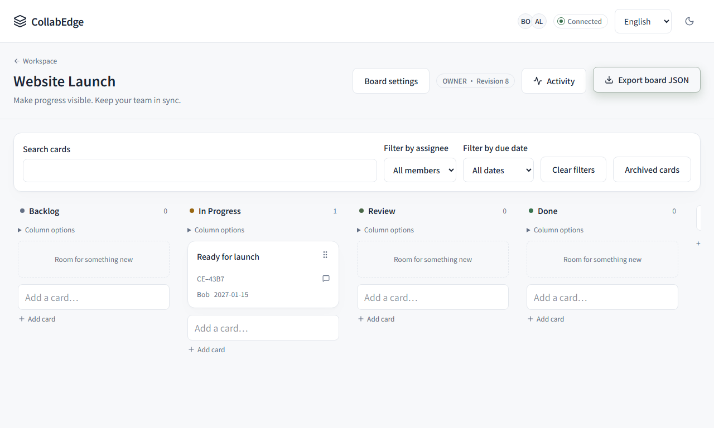
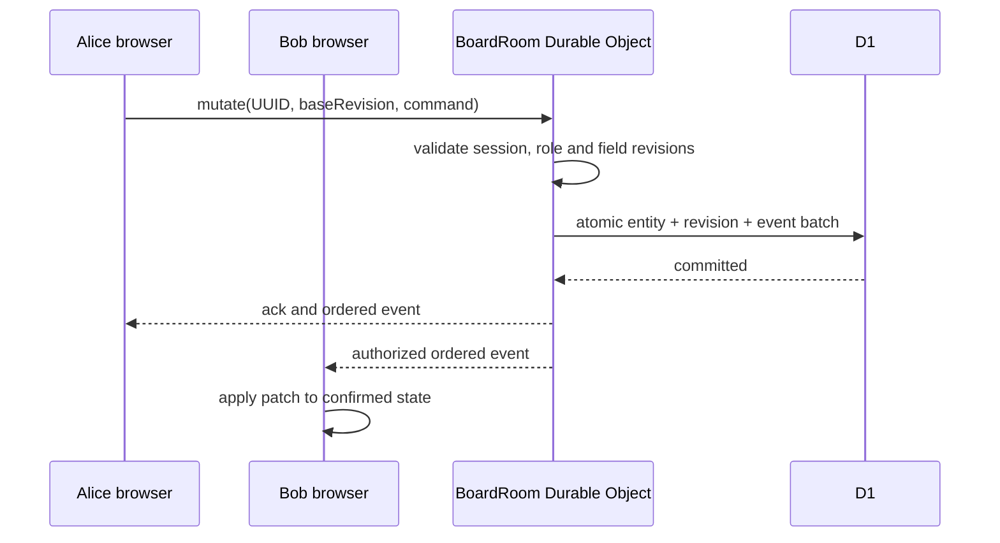

# Realtime collaboration walkthrough

CollabEdge's [public playground](https://happyloa.github.io/collab-edge/) is a browser-only simulation. This walkthrough points to the separate **two-browser Workers test** that exercises the actual HTTP API, WebSocket, Durable Object, D1 and local R2 paths. It runs against local workerd, not the Access-protected production Worker. Owner-authenticated production behavior remains [unverified](delivery-status.md).

[Watch Alice and Bob side by side](https://happyloa.github.io/collab-edge/#recorded-collaboration) in the prerecorded local test. The two video tracks were captured from one passing Playwright run; playback is not a live multi-user session on GitHub Pages.



## Reproduce it

From a fresh checkout, follow the [local setup](../README.md#local-development), install Chromium, then run:

```sh
corepack pnpm test:e2e
```

The command migrates a fresh local D1 state, runs 13 Chromium scenarios and removes that temporary state afterward. It leaves the normal development database untouched. The [collaboration scenario](../e2e/collaboration.spec.ts) gives Alice and Bob independent browser contexts and accounts. The current [CI workflow](https://github.com/happyloa/collab-edge/actions/workflows/ci.yml) runs the same suite on every push.

To regenerate the public recordings and poster images from only the collaboration scenario, run `corepack pnpm capture:demo`. This command refuses `E2E_BASE_URL`, creates disposable local D1 state and writes the media under `showcase/media/` only after the test passes.

## What the test demonstrates

| Checkpoint           | Visible behavior                                                                                                                                                  | Where to inspect                                                                                    |
| -------------------- | ----------------------------------------------------------------------------------------------------------------------------------------------------------------- | --------------------------------------------------------------------------------------------------- |
| Ordered delivery     | Alice creates a card; Bob sees it without reloading. Bob changes its title, assignee and due date; Alice receives the update.                                     | [Browser scenario](../e2e/collaboration.spec.ts), [socket client](../src/realtime/socket-client.ts) |
| Recoverable conflict | Both edit the same title. Bob saves first; Alice's stale edit shows a conflict with her attempted title intact. Alice explicitly retries and Bob sees the result. | [Browser scenario](../e2e/collaboration.spec.ts), [field conflict rules](conflict-resolution.md)    |
| Reconnect            | Bob goes offline while Alice changes the card. After reconnect, Bob reaches the current authoritative state without a page reload.                                | [Browser scenario](../e2e/collaboration.spec.ts), [replay protocol](realtime-protocol.md)           |
| Authorization        | An anonymous browser cannot download the private attachment. Other workerd tests reject viewer writes and stop delivering events to revoked members.              | [Browser scenario](../e2e/collaboration.spec.ts), [integration tests](../tests/integration.test.ts) |
| Persistence          | The board export contains the synchronized snapshot, comments and attachment metadata, without private R2 object keys.                                            | [Browser scenario](../e2e/collaboration.spec.ts), [board UI](../components/board/board.tsx)         |



The [BoardRoom implementation](../worker/durable-objects/BoardRoom.ts) serializes commands per board. D1 is canonical; a mutation UUID prevents duplicate application, and broadcasting occurs after the D1 batch commits. The client keeps optimistic changes separate from confirmed state and requests replay or a snapshot after a revision gap. [Architecture](architecture.md) and [protocol](realtime-protocol.md) document the full rules and quotas.

The local test enables **local** R2 to check private attachments. Production R2 operations remain disabled for the user's zero-additional-cost requirement, and the production hostname allows only the owner's Cloudflare Access email. The screenshot and green CI prove the local two-user flow; they do not prove an authenticated production WebSocket session.
